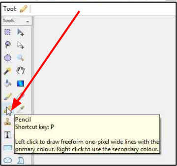
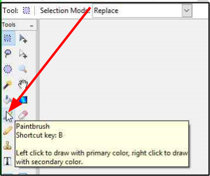
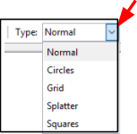
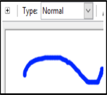
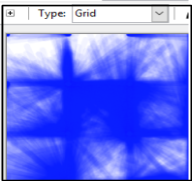
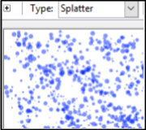
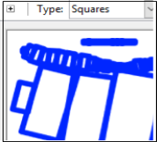

# Choose Pencil or Brush

 Pinta provides two tools for drawing (painting) directly to the image: The *Pencil* tool and the *Brush* tool. 

 The *Pencil* tool uses a hard edge and there is only one width and type of pencil. Whereas the *Brush* tool can be used to paint with smooth edges and you can change the brush width and type of brush (normal, circles, grid, splatter and squares). 

 Before selecting the *Pencil* or *Brush*, it is recommended to [**add a new layer**](layers.md) to the workpage so that it is easier to isolate/edit your pencil and brush stokes in the future.

## How to Select a Pencil 

 1. Select the *Pencil* tool  from the **Tools** menu.

     

     &nbsp;   

## How to Select a Brush     

1.  Select the *Brush* tool  from the **Tools** menu.

     

     &nbsp;  

2.  Select the desired brush width (1-55) from the **Brush width** menu options.

    

      &nbsp;  

3.  Select the desired brush type from the **Type** menu options. 

    
    
    Brush Type | When Use?| Example
    :-----------:|:-------------------------:| :------------------------------:
    **Normal** | Simple brush stroke |    
    **Circles** | Circular brush strokes |  
    **Grid**   | Grid-like brush strokes |  
    **Splatter** | Splatter brush strokes | 
    **Squares** | Square brush strokes | 

