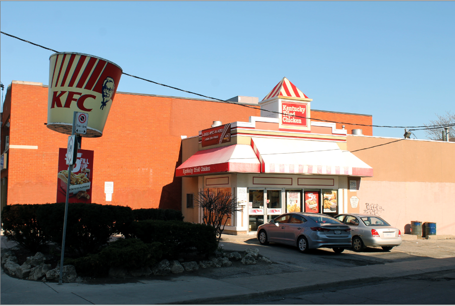
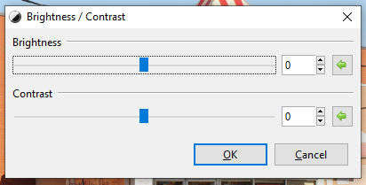
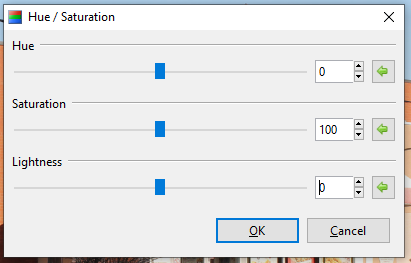

## Improving Colors ##

Pinta has to options to improve color levels in an image. Poor exposure, bad lighting, and various other elements can render a perfectly good photo unusable. You can use the auto level adjustment or manually adjust the image yourself to make your pictures pretty again

We will be using this photo to demonstrate the different color adjustments.

### Auto level: ###
The Auto-Level feature equalizes the range of colors in an image. This adjustment is used to normalize the color range of under exposed (dark) or over exposed (bright) images. It doesn’t have any configurable options, if you want to further adjust the tonal range, consider doing it manually using the levels tool. 

### Manual level: ###

If you aren’t satisfied with the results of the auto level adjustment, you can manually adjust levels, brightness and contrast, and hue and saturation. 

#### Levels ####

Levels refers to the color or tonal range of an image. Using level adjustments, users can adjust brightness, contrast, the range of tones within an image. 
This adjustment is used to alter the color range of the image, including gamma adjustments, on a channel-by-channel basis.
The most common adjustments made using Levels include changing a picture's input and output white point, black point, and grey point.

* The white point of an image is the brightest color that appears in the image. 
* The black point is the darkest color that appears in the image.
* The grey point represents the average color across the entire image and is only found on the right-hand side (Output) of the dialog.

Each of these color points of an image may be adjusted independently using Levels.

#### Brightness/contrast ####

A dialogue box with two sliders appears with one option for brightness and a second option for contrast. 
The **Brightness** control is used to make an image lighter or darker. 

* Drag slider to the right to increase brightness
* Drag slider to the left to decrease brightness

The **Contrast** control is used or to make an image more vivid or dull, it’s the difference between dark colors and light colors. Low contrast images have very muted tones or colors, whereas high contrast images have vibrant tones. 

* Drag slider to the right to increase contrast
* Drag slider to the left to decrease contrast

#### Hue/Saturation ####

A dialogue box with three sliders populates with one option for hue, a second option for saturation, and a third option for lightness.

The **Hue** slider is used as a tool to correct color. The Hue slider rotates the colors used in an image as if they were on a color wheel, allowing the current palette to be cycled around. The Hue slider will only affect the colored parts of an image, it does not affect anything in black and white.

The **Saturation** slider is used to control the vibrancy of color tones in an image. The slider rests at an initial value of 100, if dragged above 100, the image becomes more vibrant, if dragged below 100, the image becomes less vibrant and dull. 

* Drag slider to the right to increase vibrancy
* Drag slider to the left to decrease vibrancy

The **Lightness** slider is very similar to the __Brightness__ adjustment, it is used to alter the exposure of an image. The slider rests at an initial value of 0, if dragged above 0 the image becomes brighter, if dragged below 0, the image looks dimmer.

* Drag slider to the right to increase lightness
* Drag slider to the left to decrease lightness
  
The green arrow can be used to reset each slider to its original value. 
