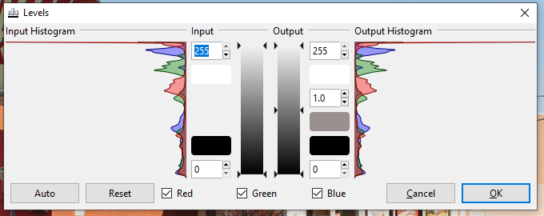

# Improving Colors #

Pinta has two options to improve color levels in an image: **auto level** and **manual level**. Poor exposure, bad lighting, and various other elements can render a perfectly good photo unusable. You can use the auto level adjustment or manually adjust the image yourself to make your pictures pretty again,

All of the color adjustment options can be found in the **Adjustments** menu:

We will be using this photo to demonstrate the different color adjustments:

## Auto level ##
The Auto Level feature equalizes the range of colors in an image. This adjustment is used to normalize the color range of under-exposed (dark) or over-exposed (bright) images. It doesn’t have any configurable options, but if you want to further adjust the tonal range, consider doing it manually using the levels tool. 

To use **Auto Level** feature:
  1. Go to **Adustments > Auto Level**. 
  
  After selecting **Auto Level**, the example photo looks like the following:

## Manual Level ##

If you aren’t satisfied with the results of the auto level adjustment, you can manually adjust levels, brightness and contrast, and hue and saturation. 

### Levels ###

**Levels** refers to the color or tonal range of an image. Using level adjustments, users can adjust brightness, contrast, and the range of tones within an image. 
This adjustment is used to alter the color range of the image, including gamma adjustments, on a channel-by-channel basis.
The most common adjustments made using **Levels** include changing a picture's input, and outputting white point, black point, and grey point.

* The white point of an image is the brightest color that appears in the image. 
* The black point is the darkest color that appears in the image.
* The grey point represents the average color across the entire image and is only found on the right side (Output) of the dialog.

Each of these color points of an image may be adjusted independently using **Levels**.

To adjust levels:
1. Go to **Adjustments > Levels**.  

The following Levels dialog box will appear:  

2. Select the desired input and output levels.

### Brightness / Contrast ###
**Brightness** control is used to make an image lighter or darker.  
**Contrast** control is used or to make an image more vivid or dull: it’s the difference between dark colors and light colors. Low contrast images have very muted tones or colors, whereas high contrast images have vibrant tones.

To adjust the brightness and contrast levels:
1. Go to **Adjustments > Brightness / Contrast**.  

The following dialog box will then appear:  

A dialog box includes two sliders with one option for brightness and a second option for contrast. 
 
2. Drag the **Brightness** slider to the right to increase brightness or to the left to decrease brightness.

3. Drag the **Contrast** slider to the right to increase contrast and to the left to decrease contrast.

### Hue / Saturation ###
**Hue** adjustments can be made to correct color.  
**Saturation** adjustments can control the vibrancy of color tones in an image.  
**Lightness** adjustments can be used to alter the exposure of an image.  

To adjust the hue and saturation levels:
1. Go to **Adjustments > Hue / Saturation**.  

The following dialogue box will appear with a slider for hue, saturation and lightness. The green arrows to the right of the sliders can be used to reset each slider to its original value:  

2. Drag the **Hue** slider to the right and left to adjust the hue. The **Hue** slider rotates the colors used in an image as if they were on a color wheel, allowing the current palette to be cycled around. The **Hue** slider will only affect the colored parts of an image: it doesn't affect anything in black and white.

3. Drag the **Saturation** slider to the right (above 100) to make the image more vibrant, and to the left (less than 100) to make the image less vibrant and more dull.

4. Drag the **Lightness** slider to the right to increase lightness, and to the left to decrease lightness.
