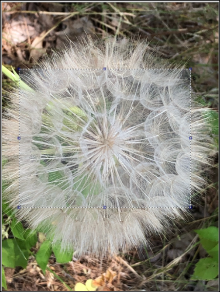
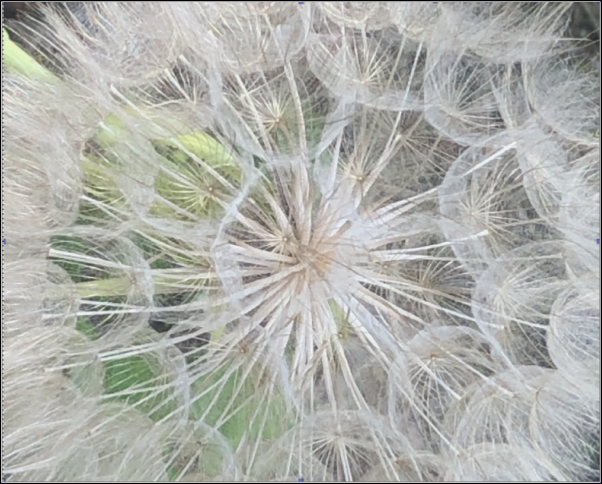
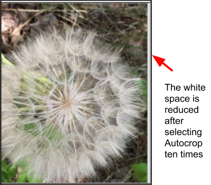

# Crop

You can remove unwanted outer areas from an image by cropping an image. There are two ways with Pinta that you can crop an image:

  - Crop to Selection: Use to remove part of the image surrounding the selection. The selected part of the image will exand to the size of the canvas. For irregulary shaped selection, such as those made by the Lasso too, the image is cropped to a rectangular bounding box that contains the selection).
  - Auto Crop - Use this feature to remove small border areas from an image. For example sometimes you may have a photo with a white border that you would like to remove and this feature enables you to remove it.

## **Crop to Selection** 

1. Select the image you want to crop from the *Images Window*.  

       

    &nbsp; 
 
  
2. [Select part of an image you want to crop using one of the selection tools](select_overview.md)

The following example used the rectangle selection to select part of the image:

3. Go to Image Menu and Choose Crop to Selection.

Here is what the example image looks like after chossing **Crop to Selection**

## AutoCrop

1. Select the image you want to auto crop from the *Images Window* or open up a new image from a file(**File>open Image File**)  

       

    &nbsp; 
 
2. Go to **Image** menu and choose **Auto Crop**.

      

    
    &nbsp; 

3. Select **Auto Crop** from the menu a number of times to reduce the amount of border on your selected image. 

    Here is an example of an image of how Auto Crop selected a number of times reduced the amount of white space on the right hand side of the image. 

    

    

