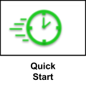
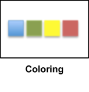
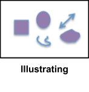
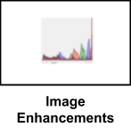
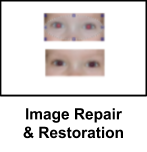
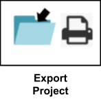
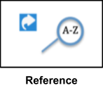
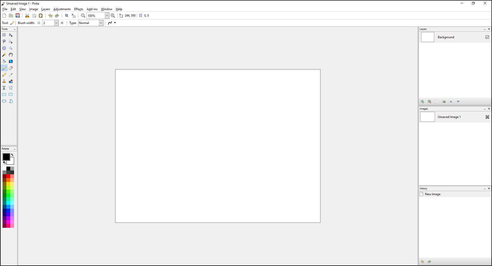

# __Bienvenu dans le guide de l'utilisateur de Pinta__ #
Ce guide a été écrit pour vous aider à prendre Pinta en main plus rapidement. Vous conaissez déjà Pinta et souhaitez apprendre de nouvelles fonctionalité ? Vous découvrez Pinta ? ce guide est fait pour vous ! Nous vous accompagnons dans vos projets de dessin ou d'édition de photo, que vous soyez débutant ou utilisateur intermédiaire. Ce guide détaille des fonctionnalités comme le dessin, le redimensionnement ou la rotation de photos ou des projets plus compliqués comme la réalisation de posters, des graphiques et la retouche photo d'un niveau professionnel (version 1.6). Ci-dessous les raccourcis vers les sections de ce guide. Vous avez également la possibilité d'utiiser le menu de gauche ou la recherche pour accéder aux sujets qui vous intéressent. A la suite des liens ci dessous vous trouverez un aperçu [**about**](index.md#about) Pinta et des [**help**](index.md#help) références.

          

## __A propos__ ##

__*Pinta: Painting Made Simple*__

Pinta est un logiciel libre et open-source d'édition d'image pour divers usages. Vous pouvez l'utiliser comme un logiciel de dessin basique tel que MS Paint ou Paintbrush sur Mac. Pinta n'intègre pas autant de fonctionnalités complexes que le logiciel libre Gimp ou les outils payant comme Adobe Photoshop, il intègre cependant l'utilisation des calques et peut être utilisé pour dessiner, coloriser,et modifier des images. Par exemple, à partir d'une capture d'écran, il est possible d'ajouter à l'image des flèches pointant vers des parties spécifiques de celle-ci.

Parmi les principales fonctionnalités de Pinta vous trouverez :

 - Support multi plateformes (Linux, Windows, Mac OS X).
 - Utilisation des calques (Non disponible sur la plupart des utilitaires d'images simples). Fonctionnalités disponibles sur des logiciels comme Photoshop ou GIMP, L'interface de Pinta étant plus conviviale pour les utilisateurs. Les calques aident à séparer et/ou à grouper les éléments pour une édition plus simple.
 - Hitorique complet permettant d'annuler facilement toute modification.
 - Environnement personnalisables.
 - Support multi-langues.
 - support des Add-ins ( i.e. possibilité de créer des brosses).
 - Intègre plus de 35 réglages et effets d'éditions d'images.

Initiallement créé et maintenu par Jonathan Pobst (jusqu'à la version 1.0), une nouvelle communauté a pris la relève pour poursuivre le développement, le support et les mises à jour.

Pour plus d'informations sur Pinta et sa communauté, visitez le site [Pinta-Project.com](https://www.pinta-project.com/) vous y trouverez:

 - [Tutoriels vidéos](https://www.pinta-project.com/howto/pinta-on-web).
 - [Comment contribuer à Pinta-Project](https://www.pinta-project.com/howto/contribute).
 - [Signaler un bug](https://github.com/PintaProject/Pinta/issues).
 - [Demande de fonctionnalités](https://github.com/PintaProject/Pinta/discussions/categories/ideas).
 - [Contacts Pinta](https://www.pinta-project.com/contact).

### __Equipe User Guide__ ###

- Anastasiya Dvuzhylov: advuzhylov@gmail.com
- Ann Karon: akaro2424@gmail.com
- Jennifer Nguyen: jeneira94@gmail.com
