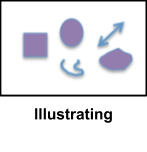
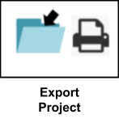

# __Welcome to our Pinta Project User Guide__ ##
This user guide was developed to help you speed up your learning curve for Pinta. Whether you have used Pinta in the past and want to learn new features or are just getting started this user guide is for you! This guide covers how to use Pinta for simple to intermediate level projects and photo edits. It details how to use basic features ranging from drawing, resizing, and rotating images to more advanced projects like posters, graphics, and professional-level photo editing and effects. To follow are some quick links to the sections of this user guide. However you can also use the left navigation menu or the search function at the top of the page to find topics of interest.

   

   

 

## __*Pinta Project: Painting Made Simple*__

Pinta is a free, open-source, raster image editor modeled after Paint.NET. Its goal is to provide users with a simple yet powerful way to draw and manipulate images on Linux, Mac, and Windows.

Originally created and maintained by Jonathan Pobst (until version 1.0), a new community has taken over the project for the community in hopes of bringing this program to the heights of Paint.Net and beyond!

Pinta is an editor with many features including drawing tools, image filters, and color adjustment tools. The focus on usability is reflected in several of the main features of the program:

- Unlimited undo history.
- Multiple language support.
- Flexible toolbar arrangement, including floating as windows or docking around the workspace edge.

Unlike some simple image editing software, Pinta also features support for image layers.

### __About__ ###

#### __Project History__ ####

The development of Pinta began in February 2010 and was driven by Jonathan Pobst, who was working at Novell at the time. In September 2011, Pobst announced that he was no longer interested in developing Pinta. Thus, a new group of enthusiastic developers continued the project in support of the product.

Pinta is written in C# and uses the GTK+ toolkit and the Cairo library. The Adjustment, Effect, and Filter features all originally came from Paint.NET but otherwise, the project is original code.

### __Help__ ###

#### __Contribute__ ####

If you are interested in contributing to the core of Pinta, like to fix a bug, or tweak existing code, you'll want to make your changes available as pull requests on GitHub. Using Git is an important part of contributing to Pinta, so if you want to read up on this, we recommend reading the excellent documentation on [GitHub](https://help.github.com/en). If you want an even deeper understanding, read [Pro Git](http://progit.org/book/).

The source code for Pinta development is available on [PintaProject GitHub](https://github.com/PintaProject/Pinta).

##### Fixing a Bug #####

If you plan to work on a bug that has been registered on the Launchpad [page](https://bugs.launchpad.net/pinta/+bugs), then go to the relevant bug and make sure no one else is already working on it, then leave a comment saying that you are working on it.

##### Creating a Pinta Fork #####

First, you need to make yourself an account with GitHub if you haven't already got one. It is recommended that you use your full name because we need something to put in the credits! Then you fork the [PintaProject Repository](https://github.com/PintaProject/Pinta), and pull the code down to your local machine (all explained [here](http://help.github.com/fork-a-repo/)).

##### Writing, Compiling and Testing #####

This is where the magic happens! Make whatever changes are necessary to the source code, but please __do not attempt__ to clean up the existing code. We are only interested in seeing functional changes to the code. If they are mixed with cosmetic changes, it becomes very difficult to see what has changed. Build your code according to the [building instructions](https://github.com/PintaProject/Pinta/blob/master/readme.md), and test it to make sure it does what it's supposed to and doesn't do anything it's not supposed to.

##### Committing your Fix #####

When you are satisfied that you have a great fix to share with the world, commit it to your GitHub fork. (See the second part of [Create A Repo](http://help.github.com/create-a-repo/).) Make sure that the commit message includes the bug number and a short description. This is vital so that the developers know what exactly they are looking at. Then it will be publicly visible for scrutiny, which comes in handy for the next step.

##### Sending a GitHub Pull Request #####

Pull requests are thoroughly explained [here](http://help.github.com/send-pull-requests/). You will want to send a pull request to the Pinta repository from your fork. When the developers see your request, they will test your solution and if it is good, they will merge it into the Pinta source code. They will then close the bug on Launchpad and add your name to the credits as a contributor and you get a lovely warm feeling inside from helping make the world a better place!

##### Translation #####

Another way to contribute to Pinta without writing a line of code is to translate Pinta into a new language. This is all done through a web page, so all you need to know is a second language.

- [Pinta Translation Page](https://translations.launchpad.net/pinta)

#### __Report Bugs & Feature Requests__ ####

One way to contribute to Pinta without writing code is to file bugs when things don't work. Bug reports let developers know what needs to be fixed in Pinta. If you have a great idea for a new feature for Pinta, we've got a place where you can submit your ideas and vote on which ones should be implemented.

- [Pinta Bug Tracker](https://bugs.launchpad.net/pinta/+bugs)
- [Pinta Feature Requests](https://pinta-project.com/suggestions)

#### __Contact__ ####

##### Mailing List #####

You can join Pinta's mailing list on Google Groups:

[Pinta Project Mailing List](http://groups.google.com/group/pinta?hl=en)

##### Facebook #####

You can join Pinta's Facebook Page and Group:

- [Pinta Facebook Page](http://www.facebook.com/pages/Pinta/249343198437410)
- [Pinta Facebook Group](http://www.facebook.com/groups/198103533589299/)

##### __Pinta Creators__ #####

- __Lead Maintainer:__ Cameron White (cameronwhite91 at gmail dot com)

- __Developer:__ Robert Nordan (rpvn at robpvn dot net)

- __Developer:__ Olivier Dufour (olivier dot duff at gmail dot com)

- __Developer (Project Founder):__ Jonathan Pobst (monkey at jpobst dot com)

- __Documentation & PR Editor:__ Johnathan Morlock (johnathan underscore morlock at tsgcomputers dot net)
