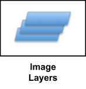
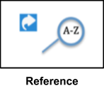

# __Welcome to our Pinta Project User Guide__ #
This user guide was developed to help you speed up your learning curve for Pinta. Whether you have used Pinta in the past and want to learn new features or are just getting started this user guide is for you! This guide covers how to use Pinta for simple to intermediate level projects and photo edits. It details how to use basic features ranging from drawing, resizing, and rotating images to more advanced projects like posters, graphics, and professional-level photo editing and effects. To follow are some quick icon button links to the sections of this user guide. However you can also use the left navigation menu or the search function at the top of the page to find topics of interest. Following these quick link icon buttons there is an overview [**about**](index.md#about) Pinta and some [**help**](index.md#help) resources to refer to beyond this guide. 

          

## __About__ ##

__*Pinta Project: Painting Made Simple*__

Pinta is a free, open-source bitmap image editor with a versatile range of uses. It can be used as a basic graphics editor or paint tool similar to MS Paint and Paintbrush for Mac. While Pinta is not as feature rich as some paid software such as Adobe Photoshop, it does work with a design layered approach (unlike other free bitmap image editors) and can be used to draw, colour, and edit pictures. For example, using a screenshot from a display, one can modify the image to include arrows pointing to specific parts of the image. 

Some of the main feature benefits of Pinta include:  

 - Multiple operating system support (Linux, Windows, and Mac OS X).  
 - Layering (most simple bitmap editors don't have this capability). This feature is available in programs like Photoshop and GIMP but Pinta’s system is more user-friendly for all levels of users. Layers help separate and group elements of an image for easy editing.  
 - Full history enabling users to experiment as you can always use the undo feature to easily to revert changes and actions.   
 - Customizable workspace.  
 - Multiple language support.  
 - Add-ins capability ( i.e. can write a custom brush).  
 - Has over 35 adjustments and effects for editing images.  
 

Originally created and maintained by Jonathan Pobst (until version 1.0), a new development community has taken over the project to continue support and updates.

If you'd like more information about the background of Pinta and of the Pinta community, go to the [Pinta-Project.com](https://pinta-project.com/pintaproject/pinta/) website which includes the following information:

 - [Video Tutorials](https://pinta-project.com/pintaproject/pinta/howto/pinta-on-web).  
 - [How to Contribute to the Pinta-Project](https://pinta-project.com/pintaproject/pinta/contribute).  
 - [Reporting Bugs](https://bugs.launchpad.net/pinta).  
 - [Feature Requests](https://communiroo.com/pintaproject/pinta/suggestions).  
 - [Pinta Contacts](https://pinta-project.com/pintaproject/pinta/contact).  
