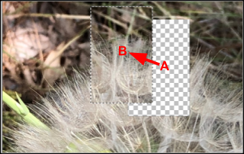
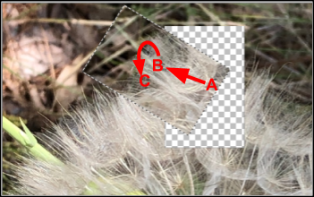

# Move Image
To move and rotate a selected portion of your image using the *Move Selected Pixels* Tool follow the following steps.

1.  Select the image that you would like to work with under the *Image Window*.

       

    &nbsp; 
 
  
2.  Select a portion of the image using the [magic wand](wand.md), [lasso](lasso.md), [rectangle](rectangle.md) or [ellipse](ellipse.md) tools. If no selection is active, the tool moves the entire active layer.

 
    &nbsp; 

3.  Select the *Move Selected Pixels* Tool  from the **Tools** Menu.

       
 
    &nbsp;

3.  Left click and and drag the selected image portion from its original location (example position **A**) to a new location (example position **B**). Once the pixels have been moved an area of transparency (denoted by the grey and white checkerboard pattern) will be left in place of the moved pixels. Refer to the example below.

    

      
 
 
    &nbsp;

!!! Note 
    The checkerboard pattern that remains after pixels are moved indicates that the region is transparent and serves as a visual cue (is not actually part of the image).

4.  Right click and drag the selection to rotate the selected outline (Example position **C**) by the desired rotation amount.

      
 
 
    &nbsp;
!!! Note 
    The Right Mouse button always accesses rotation - regardless of the location of the cursor.

