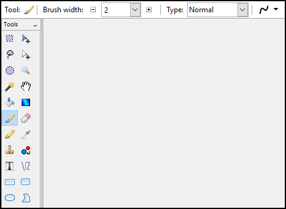
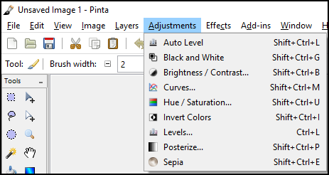

## __General Overview__ ##

When the Pinta workspace first loads, you'll notice it has an uncluttered layout that is similar to MS Paint, but has more advanced features compared to it.

### Pinta Workspace: ###
[Menu Bar](#menu-bar-features) - at the top, below the Title bar, contains drop-down menus.

[Toolbar](#toolbar-features) - under the Menu bar, contains buttons and other elements which can be used to perform some of the more common operations.

[Tools Menu](#tools-menu-features) - in the upper-left under the Toolbar, contains a group of icons or buttons grouped together that provide you with a quick way to select commonly used functions by pointing and clicking. It works in conjunction to the Tools Preview(?) just right above it.

Palette Menu - in the lower-left under the Tools Menu, provides you with quick access to a preset of colors. You can select your primary and secondary color by left-clicking or right-clicking on the color of choice.

Layers Window - in the upper-right corner under the Toolbar, displays the number of layers and the active window. Layers in Pinta can be transparent, translucent, or opaque.

Images Window - in the middle-right size under the Layers Window, displays the opened images that you can use as part of your layers and base image. 

History Window - in the lower-right corner, displays a list of commands or operations performed. Can be undone or redone by selecting a command that was performed.

### Menu Bar Features ###

File - 

Edit - 

View - 

Image - 

Layers - 

Adjustments - 

Effects - 

Add-ins - 

Window - 

Help - 

### [Toolbar Features](#general-overview) ###

New - 

Open - 

Save - 

Cut - 

Copy - 

Paste - 

Undo - 

Redo - 

Crop to Selection - 

Deselect All - 

Zoom - 

Cursor Location(?) - 

Selection Location(?) - 

### Tools Menu Features ###

Rectangle Select - This tool is used to select portions of the picture. This tool selects rectangle sections only. When a portion of a picture is selected tools that are used will only work in the selected area. If a square selection is needed hold the shift key when selecting the area, this will make a square selection.

Move Selected Pixels - This tool is used to move, rotate and scale a selected section of the photo, or to move layers of the image made in Pinta.

Lasso Select - This tool is used to hand select which sections of the image you want selected. This is done by selecting this tool and the drawing around the portion of the image you want selected while holding down the left mouse button.

Move Selection - This tool is used to modify the size, rotation, and scale of what you are selecting. For example if you used to Rectangle Selection and made the rectangle too small for the area you wanted to select you can use this tool to resize and move the selection to where you want it to be.

Ellipse Select - This tool works in much the same way as the Rectangle Select except it select elliptical sections (like the rectangle tool if you hold shift down it will select a circle region instead of an ellipse).

Zoom - This tool is used to view the image being worked on more closely. After selecting this tool click on the section of the image you wish to view more closely.

Magic Wand Select - The magic wand tool is used to select sections of the image that are similar. This tool can be adjusted to grab more or less of the image that resembles where it was used.

Pan - This tool is used to move around in the image when the image is larger than the screen. To use this tool click in an area (the best area to select is somewhere in the middle of the picture) then hold down the left mouse button and move the cursor. The image will move as if you grabbed the image where you clicked and pushed or pulled the image in the direction that you moved the cursor.

Paint Bucket - This tool is used to fill areas of similar color with another solid color.

Gradient - This tool is used to gradients in colors as well as image fading between images.

Paint Brush - This tool is used to free hand markings on the image. These markings can be made in the selected color and in a verity of sizes.

Eraser - This tool is used to remove parts of an image or layer. When used on an image, or bottom layer it will leave a transparent background. When used on a layer other than the bottom one this will leave a hole in the layer that will show the underlying layer.

Pencil - This tool is used to make free hand markings that are 1 pixel in size.

Color Picker - This tool is used to select a color from the image you are working on.

Clone Stamp - This tool is used to select a section of the picture that will be replicated into another section. This can be useful for eliminating troublesome sections that has multiple colors, patters, or textures as it will replicate those section as place them in the image.

Recolor - This tool used to replace the one color with another.

Text - This tool is used to add text to the image. This tool has the options to change the font with any font loaded on your computer as well as the font color.

Line/Curve - This tool is used to create either straight or curved lines. In the options toolbar (located under the menu bar, is a selection for adding arrows to the begging or end of the line being created.

Rectangle - This tool is used to create rectangles that can be either outlines, or filled shapes.

Rounded Rectangle - This tool is similar to the rectangle tool except it creates rectangles with rounded corners.

Ellipse - 

Freeform Shape - 