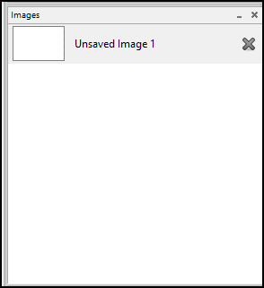
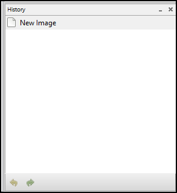
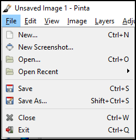
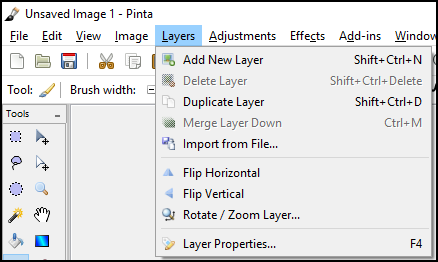

# __General Overview__ #

When the Pinta workspace first loads, you'll notice it has an uncluttered layout that is similar to MS Paint, but has more advanced features in comparison.

## __Pinta Workspace__ ##
[__Menu Bar__](#menu-bar-features) - contains drop-down menus.

[__Toolbar__](#toolbar-features) - contains buttons and other elements which can be used to perform some of the more common operations.

[__Tools Menu__](#tools-menu-features) - contains a group of icons or buttons grouped together that provide a quick way to select commonly used tools. It works in conjunction to the Tools Settings Bar just right above it to modify the tool properties.

[__Palette Menu__](palette.md) - provides you with quick access to a preset of colors. You can select your primary and secondary color by left-clicking or right-clicking on the color of choice.

[__Layers Window__](layers.md) - displays the number of layers and the active window. Layers in Pinta can be transparent, translucent, or opaque as well as being visible in the workspace or not.

__Images Window__ - displays the opened images that you can use as part of your layers and base image.

[__History Window__](setup.md#Using-Undo-or-Redo-Functions) - displays a list of commands or operations performed. Can be undone or redone by selecting a command that was performed in the displayed list.

## __Menu Bar Features__ ##

__File__ - contains commands that allow you to create a new image, take a screenshot of your desktop, open an image, save an image, close an image, and quit the program within Pinta.

__Edit__ - contains commands relating to the handling of information within an image and the manipulation of an image. Each of the commands have a set of [shortcut keys](shortcuts.md) assigned to them (except Palette), to help provide a quicker method of navigating and executing these commands.

__View__ - contains commands that change the way your image project is displayed in the workspace. The commands or features in this menu does not alter your image.

__Image__ - contains commands that affect the image in some way. Most of the image adjustments in the menu have associated keyboard [shortcuts](shortcuts.md). The commands that have three dots "..." will have a pop-up window that offers feature properties. This menu is used in conjunction with the Images Window.

[__Layers__](layers.md) - contains commands that only affect the active layer. That is the layer highlighted in the Layers Window. It also has a Layers Properties command that can manipulate the type of layer it's going to hold.

__Adjustments__ - contains commands which modify the colorization of pixels in the entire active layer. Each of the default editing adjustments in the menu have associated keyboard [shortcuts](shortcuts.md).

[__Effects__](effects.md) - contains commands which apply special effects to a selection within a layer or to an entire active layer. These commands are found within one of seven sub-menus.

__Add-ins__ - will allow you to install more effects, adjustments, and tools via the Add-in Manager. The Add-In Manager provides an easy way to manage any plugins or extensions you might have installed.

__Window__ - has two commands. Below those commands you'll notice an image name for each image that you currently have open. A dot will be displayed to the left of the active image. You can switch between images using the shortcut keys `Alt` + `1` for image one, `Alt` + `2` for image two, `Alt` + `3` for image three, and etc. The image names listed in the Window menu will be the same names that are listed in the Images Window.

[__Help__](index.md#help) - provides quick access to a number of online resources like the [Pinta Website](https://www.pinta-project.com/), [File a Bug](https://bugs.launchpad.net/pinta[), [Translate This Application](https://translations.launchpad.net/pinta), and About.

## __[Toolbar Features](#general-overview)__ ##

 __New__ - command allows you to create a new, blank, single-layered image.

 __Open__ - command allows you to open an existing image for editing.

 __Save__ - command allows you to save the image with the current file name.

 __Cut__ - command allows you to remove a selected portion of the active layer and place it on the clipboard (a clipboard is a temporary storage area for data that the user wants to copy from one place to another).

 __Copy__ - command duplicates the selected region to the clipboard. Unlike the Cut command, the Copy command leaves the selection on the active layer. The current selection also remains active in the active window.

 __Paste__ - command allows you to insert an image or a selected section of a layer from the clipboard into the active layer.

 __Undo__ - command allows you to erase the last change done to a project, reverting it to an older state. Notice the History Window when you click on the Undo command - the selected item moves up the list to the previous item.

 __Redo__ - command allows you to reverse your last Undo. Notice the History Window when you click on the Redo command - the selected item moves down the list to the next item. So the Redo command restores any actions that have been previously undone using an Undo.

 __Crop to Selection__ - command is only available to a selected part of an image. To see how this feature works, click the Rectangle Select button on the Tool Palette and then select an object in your image.

 __Deselect All__ - command forces all selected pixels to be deselected. After you use this command, you'll have no pixels in the active window selected.

 __Zoom__ - command gives it the appearance of magnifying it or moving away from the image. You can use the drop-down menu to select a specific percentage zoom setting.

 __Cursor Indicator__ - to show pixel coordinates where the computer cursor is located on the image.

 __Selection Indicator__ - to show the pixel area of the selection.

## __Tools Menu Features__ ##

 __Rectangle Select__ - used to select portions of the project in a rectangle shape. When a portion of a project is selected, tools that are used will only work in the selected area of the project. If a square selection is needed, hold the `Shift` key when selecting the area. Holding down the left-click button on your mouse to select and holding down the right-click button on your mouse to deselect.

 __Lasso Select__ - used to custom select which sections of the project you want selected. This is done by drawing around the portion of the project you want selected while holding down the left-click button on your mouse.

 __Ellipse Select__ - works the same way as the Rectangle Select except it selects in an elliptical shape. Like the Rectangle Select, if you hold the `Shift` key, it will select a circular shape instead of an ellipse.

 __Magic Wand Select__ - used to select sections of the image that are similar. This tool can be adjusted to grab more or less of the image that resembles where it was used.

 __Paint Bucket__ - used to fill areas of similar color with another solid color.

 __Paint Brush__ - used to make free-hand inking and painting on the layer. This tool can be customized using the Palette and the Tools Settings Bar to change its properties.

 __Pencil__ - used to make free-hand pencil marks on the layer that are 1 pixel in size.

 __Clone Stamp__ - used to select a section of the layer that will be replicated into another section. This can be useful for eliminating troublesome sections that has multiple colors, patterns, or textures as it will replicate those section and place them in the layer.

 __Text__ - used to add text to the project. This tool has the option to change the font with any font loaded on your computer as well as the font color in the Tools Settings Bar.

 __Rectangle__ - used to create rectangles that can be either outlined or filled shapes. If you hold the `Shift` key, it will create a square shape instead of a rectangle.

 __Ellipse__ - used to create elliptical shapes that can be either outlined or filled shapes. Like the rectangle tool, if you hold the `Shift` key, it will create a circle shape instead of an ellipse.

 __Move Selected Pixels__ - used to move or rotate a selected section of the project, and to move or rotate layers of the project. To move, hold down the left-click button on your mouse to drag the selection or layer around. To rotate, hold down the right-click button on your mouse to turn the selection or layer around.

 __Move Selection__ - used to move or rotate the selection itself. To move, hold down the left-click button on your mouse to drag the selection around. To rotate, hold down the right-click button on your mouse to turn the selection around.

 __Zoom__ - used to view the project being worked on more closely. After selecting this tool, click on the section of the image you wish to view more closely.

 __Pan__ - used to move around in the project workspace when the area being worked on is larger than the screen. To use this tool, click in an area (the best area to select is somewhere in the middle of the workspace project) then hold down the left-click button on your mouse and move the hand around. The image will move as if you grabbed the image where you clicked, and push or pull the project in the direction that you moved the hand.

 __Gradient__ - used to create a gradual blend between the primary and secondary color from the palette. Hold down the right-click button on your mouse to reverse the primary and secondary color gradient blend.

 __Eraser__ - used to remove parts of a layer. When used on a bottom layer, it will leave a transparent background. When used on a layer other than the bottom will leave a hole in the layer that will show the next underlying layer.

 __Color Picker__ - used to select a color from the image or layer you are working on.

 __Recolor__ - used to replace the primary color with the secondary color. Hold down the right-click button on your mouse to reverse the secondary for the primary color.

 __Line/Curve__ - used to create either straight or curved lines. To customize the line, change the tool properties in the Tools Settings Bar.

 __Rounded Rectangle__ - is similar to the rectangle tool except it creates rectangles with rounded corners.

 __Freeform Shape__ - use to create irregular shapes that can be either outlined or filled shapes.
