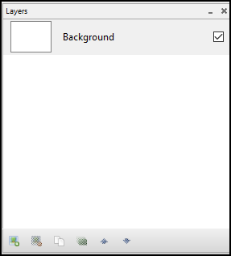
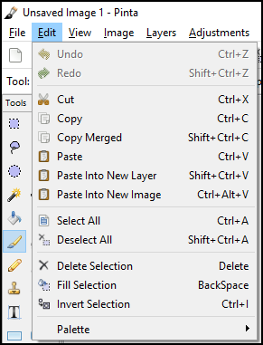
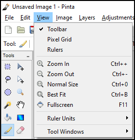
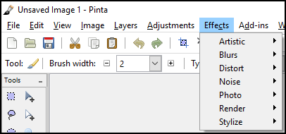

## __General Overview__ ##

When the Pinta workspace first loads, you'll notice it has an uncluttered layout that is similar to MS Paint, but has more advanced features compared to it.

### Pinta Workspace: ###
[__Menu Bar__](#menu-bar-features) - at the top, below the Title bar, contains drop-down menus.

[__Toolbar__](#toolbar-features) - under the Menu bar contains buttons and other elements which can be used to perform some of the more common operations.

[__Tools Menu__](#tools-menu-features) - in the upper-left under the Toolbar, contains a group of icons or buttons grouped together that provide you with a quick way to select commonly used functions by pointing and clicking. It works in conjunction to the Tools Settings Bar just right above it.

[__Palette Menu__](palette.md) - in the lower-left under the Tools Menu, provides you with quick access to a preset of colors. You can select your primary and secondary color by left-clicking or right-clicking on the color of choice.

[__Layers Window__](layers.md) - in the upper-right corner under the Toolbar, displays the number of layers and the active window. Layers in Pinta can be transparent, translucent, or opaque.

__Images Window__ - in the middle-right side, under the Layers Window, displays the opened images that you can use as part of your layers and base image. 

__History Window__ - in the lower-right corner, displays a list of commands or operations performed. Can be undone or redone by selecting a command that was performed.

### Menu Bar Features ###

__File__ - contains commands that allows you to create a new image, take a screenshot of your desktop, open an image, save an image, close an image, and quit the program within Pinta. 

__Edit__ - contains commands relating to the handling of information within an image and the manipulation of an image. The commands found in the Edit menu are: Undo, Redo, Cut, Copy, Copy Merged, Paste, Paste into New Layer, Paste into New Image, Select All, Deselect All, Delete Selection, Fill Selection, Invert Selection, and Palette. Each of the commands have a set of shortcut keys assigned to them, except for the Palette command, to help provide an easier and quicker method of navigating and executing these commands.

__View__ - contains commands that change the way your photo or image is displayed. The commands or features in this menu does not alter your image or photo, only the way it is presented on your screen. 

__Image__ - contains commands that affect the image in some way. Most of the image adjustments in the menu have associated keyboard shortcuts. The commands that have three dots ... will have a dialog box that offer additional features. This menu is used in conjunction with the Images Window.

__Layers__ - contains commands that only affect the active layer. That is the layer selected or highlighted in the Layers Window. It also has a Layers Properties command that can manipulate the type of layer its going to hold.

__Adjustments__ - contains commands which modify the colorization of pixels in an image. Each of the default photo editing adjustments in the menu have associated keyboard shortcuts.

__Effects__ - contains commands which apply special effects to a selection within an image or to an entire active layer. These commands are found within one of seven sub-menus. The default seven sub-menus that make up the Effects menu are: Artistic, Blurs, Distort, Noise, Photo, Render, and Stylize.

__Add-ins__ - will allow you to install more effects, adjustments, and tools via the Add-in Manager. The Add-In Manager provides an easy way to manage any plugins or extensions you might have installed. 

__Window__ - has two options or commands. They are Save All (`Ctrl`+`Alt`+`A`) and Close All (`Shift`+`Ctrl`+`W`). Below those features you'll notice an image name for each image that you currently have open. A dot will be displayed to the left of the active image. You can switch between images using the short cut keys `Alt`+`1` for image one, `Alt`+`2` for image two, `Alt`+`3` for image three, and etc. The image names listed in the Window menu will be the same names that is listed in the Images Window.

[__Help__](index.md#help) - provides quick access to a number of online resources like the Pinta Website, File a Bug, Translate This Application, and About. 

### [Toolbar Features](#general-overview) ###

__New__ - command allows you to create a new, blank, single layered image.

__Open__ - command allows you to open an existing image for editing.

__Save__ - command allows you to save the image with the current filename.

__Cut__ - command allows you to remove a selected portion of the active layer and place it on the clipboard. (A clipboard is a temporary storage area for data that the user wants to copy from one place to another.) 

__Copy__ - command copies the selected region to the clipboard. Unlike the Cut command, the Copy command leaves the selection on the active layer. The current selection also remains active in the active window. 

__Paste__ - command allows you to insert an image or selected section of an image from the clipboard into the active image.

__Undo__ - command allows you to erase the last change done to an image, reverting it to an older state. Notice the History Pane when you click on the Undo command. The selected item moves up the list to the previous item.

__Redo__ - command allows you to reverse your last Undo. Notice the History Pane when you click on the Redo command. The selected item moves down the list to the next item. So, the Redo command restores any actions that have been previously undone using an Undo.

__Crop to Selection__ - command is only available to a selected part of an image. To see how this feature works, click the Rectangle Select button on the Tool Palette and then select an object in your image.

__Deselect All__ - command forces all selected pixels to be deselected. After you invoke this command, you'll have no pixels in the active window selected.

__Zoom__ - command gives it the appearance of magnifying it or moving away from the image. You can use the drop-down menu to select a specific percentage zoom setting.

__Cursor Indicator__ - to show pixel coordinates where the computer cursor is located on the image.

__Selection Indicator__ - to show pixel area of the selection.

### Tools Menu Features ###

__Rectangle Select__ - used to select portions of the picture. This tool selects rectangle sections only. When a portion of a picture is selected tools that are used will only work in the selected area. If a square selection is needed hold the shift key when selecting the area, this will make a square selection.

__Lasso Select__ - used to hand select which sections of the image you want selected. This is done by selecting this tool and the drawing around the portion of the image you want selected while holding down the left mouse button.

__Ellipse Select__ - works in much the same way as the Rectangle Select except it select elliptical sections (like the rectangle tool if you hold shift down it will select a circle region instead of an ellipse).

__Magic Wand Select__ - used to select sections of the image that are similar. This tool can be adjusted to grab more or less of the image that resembles where it was used.

__Paint Bucket__ - used to fill areas of similar color with another solid color.

__Paint Brush__ - used to free hand markings on the image. These markings can be made in the selected color and in a verity of sizes.

__Pencil__ - used to make free hand markings that are 1 pixel in size.

__Clone Stamp__ - used to select a section of the picture that will be replicated into another section. This can be useful for eliminating troublesome sections that has multiple colors, patters, or textures as it will replicate those section as place them in the image.

__Text__ - used to add text to the image. This tool has the options to change the font with any font loaded on your computer as well as the font color.

__Rectangle__ - used to create rectangles that can be either outlines, or filled shapes. If you hold `Shift` down, it will select a square region instead of a rectangle. 

__Ellipse__ - used to create elliptical shapes that can be either outlines, or filled shape. Like the rectangle tool if you hold `Shift` down, it will select a circle region instead of an ellipse

__Move Selected Pixels__ - used to move, rotate and scale a selected section of the photo, or to move layers of the image made in Pinta.

__Move Selection__ - used to modify the size, rotation, and scale of what you are selecting. For example if you used to Rectangle Selection and made the rectangle too small for the area you wanted to select you can use this tool to resize and move the selection to where you want it to be.

__Zoom__ - used to view the image being worked on more closely. After selecting this tool click on the section of the image you wish to view more closely.

__Pan__ - used to move around in the image when the image is larger than the screen. To use this tool click in an area (the best area to select is somewhere in the middle of the picture) then hold down the left mouse button and move the cursor. The image will move as if you grabbed the image where you clicked and pushed or pulled the image in the direction that you moved the cursor.

__Gradient__ - used to gradients in colors as well as image fading between images.

__Eraser__ - used to remove parts of an image or layer. When used on an image, or bottom layer it will leave a transparent background. When used on a layer other than the bottom one this will leave a hole in the layer that will show the underlying layer.

__Color Picker__ - used to select a color from the image you are working on.

__Recolor__ - used to replace the one color with another.

__Line/Curve__ - used to create either straight or curved lines. In the options toolbar (located under the menu bar, is a selection for adding arrows to the begging or end of the line being created.

__Rounded Rectangle__ - is similar to the rectangle tool except it creates rectangles with rounded corners. If you hold `Shift` down, it will select a square region instead of a rectangle.

__Freeform Shape__ - used to create irregular shapes that can be either outlines, or filled shape.