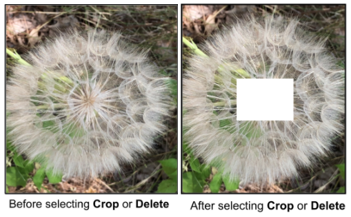
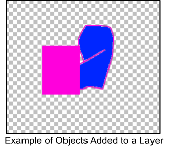
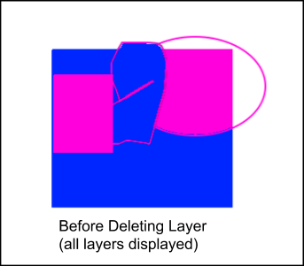

# Remove Items

 You can romove items a number of different ways using Pinta:  

 -  [**Cut**](remove_items.md#remove-item-with-cut-or-delete): Use the cut option under the edit menu to delete anything in the image that has been selected.
 -  [**Delete Key**](remove_items.md#remove-item-with-cut-or-delete): Use the **`Delete`** key on your keyboard to delete anything that has been selected.
 -  [**Remove a Layer**](remove_items.md#remove-itme-by-removing-layer): Use to delete all images on a layer and keep all images on other layers. 

## Remove items with Cut or Delete 

1. Select from the *Images Window* the image that you would like to remove items from

       

    &nbsp; 
 
  
2. [Select part of an image](select_overview.md) you would like to remove using one of the selection tools.

    The following example used the rectangle selection to select part of the image:

    

    &nbsp;

3. Go to **Edit** menu and choose **Cut** or select the **`Delete Key`** on your keyboard.

    

    Here is what the example image looks like after **Cut** was selected or **Delete Key** was pressed:

    

## Remove Item by Removing Layer

If you save items on separate layers than if you remove a layer you will remove the items on that layer from your image.

The following shows an example of how this would be done.

1. [Create a layer](layers.md) that is blank or [import a file to a layer](layers.md)

2. Add any objects to the layer 
   
    
    &nbsp;  

3. Select the *Layer* in the **Layer** Window (it will already be selected if you just added the objects to the layer)

    

    &nbsp;  

4. Select delete layer from the **Layer** Window. 

    

    The following shows the result of deleting layer 2 in the example above.

    

    

