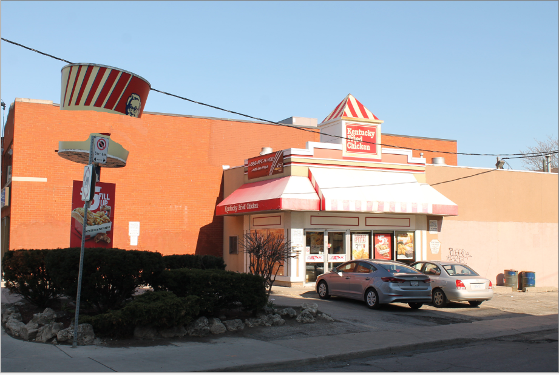

## Remove objects from photo ##

The [**Clone Stamp**](clone.md)  tool can be used to remove objects from a photo. Simply set the sample point to something next to the object and using the clone stamp brush, paint over the desired object to mask it. 

 1. Select the *Clone Stamp* tool  from the **Tools** menu.
 2. Adjust the size of the clone stamp brush using the brush width drop down
 3. Turn anti-aliasing on or off depending on desired outcome, when turned on the painted edges are smooth, when off the edges appear more jagged.
 4. Hold down `CTRL` and click desired part of image to set sample point.
 5. Click and drag, as you would with the paintbrush tool, to paint with the cloned sample point.

We will use this photo of KFC as an example.

By selecting `CTRL` + `Click` my sample first as the brick wall, I am able to begin to cover up the bottom of the KFC bucket.

Next, I set my sample to the sky and begin to paint over the top of the bucket. 

Finally, the bucket is gone! But the wire is missing a large chunk.

I connect the wire using the [line](objects.md) tool. 
Now it looks like there was never a bucket to begin with!

