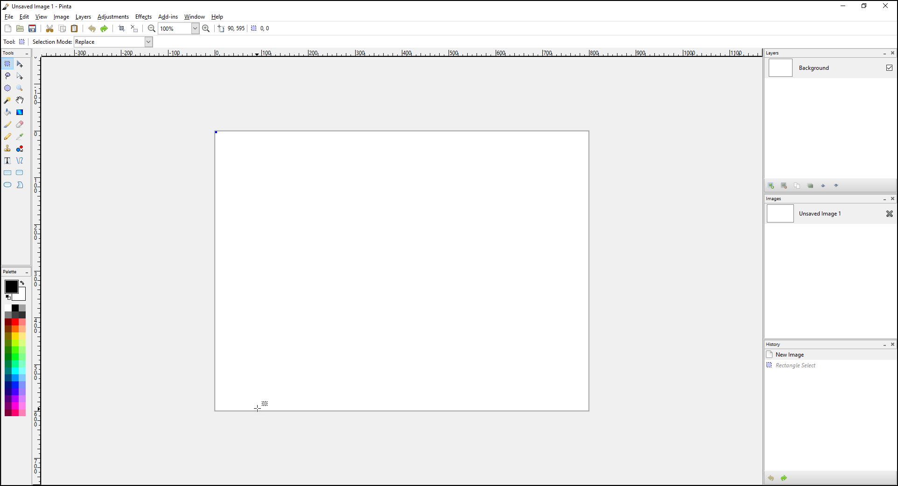
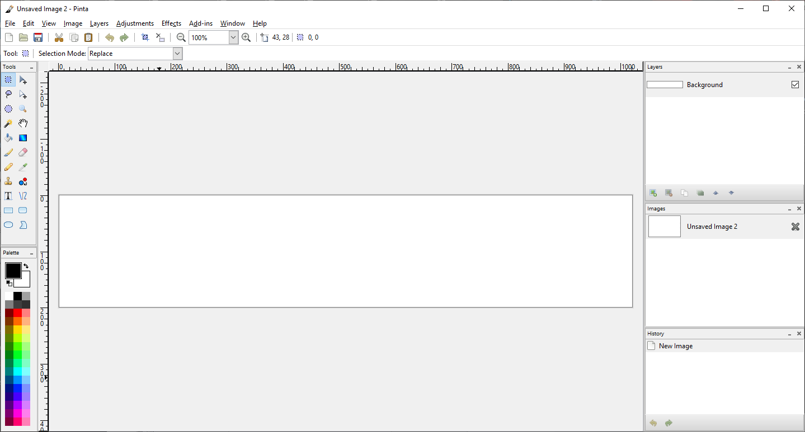
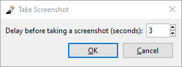

# __Setting Up Workspace__ #

!!! Note
    If you haven't installed the program yet, go to the [**Getting Started**](start.md) section of this guide for step by step installation instructions.

It's recommended to invest in a drawing tablet if you want to use the program to create digital art, but using the good old-fashioned mouse is still perfectly fine to create your art as well. In this section, we'll be guiding you on setting up your workspace and understanding how to get started on creating a project (it could be editing photographs to painting landscapes to creating a cartoon character).

If you aren't familiar with the tools and the menus, we recommend to check out the [__General Overview__](overview.md) page to learn more and give context to the workspace.

## __Default Setup__ ##

Open Pinta if you haven't already and you will see a blank workspace that looks like this:  

As you can see from the **Layers** window, you have one layer called __Background__. When you want to work on an illustration or a photograph, you will need to [create a new layer](layers.md) to work on because you want to keep the background layer for any background elements that will show in your final composite image. T

Once you have setup your new layer, you can start working on your project in that new layer or any other new layers you have created. As well you can [import an image to a layer from a file](layers.md#import-file-into-layer).

## __Setup with a Custom Canvas__ ##

When you open Pinta, it starts with a default canvas size of 640 x 480. You can create a custom size depending on the project you are creating. For example, you may want to create a banner such as this:

To customize the canvas size, create a new image and select the desired sizing of your canvas.

1. Select __New...__  in the Toolbar or go to **File > New...**.
2. Select a preset to change the canvas size or customize with the listed options to modify the width, height, orientation, and the type of background. You can see a preview of it in the window when you are making the modifications.  

3. Select __OK__ to apply the change.

## __Setup with a Screenshot__ ##

You can create a project with a screenshot of your screen(s). If you have multiple screens, it will also capture those too so it's recommended to use the [cropping tool](crop.md) to keep what you need.

Go to **File > New Screenshot...** .
2. Choose the length of the delay you require for the capture to start.  

3. Select __OK__ to capture.  

## __Customizing the Workspace__ ##

Before you begin to work on your project, you can customize how your workspace looks to make the area easier for you to use. Using the [View menu](overview.md#Menu-Bar-Features), you can:
- Check or uncheck the Toolbar to hide or view it.
- Check or uncheck the Pixel Grid to turn on or off the pixel-sized gridlines (mainly used for pixel editing).
- Check or uncheck the Rulers to hide or view the workspace pixel-sized rulers.
- Change your ruler measurement in case you needed to use inch or centimeters instead of pixels.
- Select the zooming function if you need to take a closer look at your work area.
- Select Normal Size to view your image at 100% zoom.
- Select Best Fit to view the image in its entirety.
- Check or uncheck your workspace tools and windows to hide or view any features you may need.

## __Saving the New Project__ ##

Once you have created your project in the workspace, save your progress as an ORA file so that you can continue it the next time you are editing the same project. ORA stands for OpenRaster Image. The purpose of this file type is to save the image project with the [layers](concept.md#layers) still intact so you can utilize the file in Pinta or any raster graphic editor. 

If the file is saved as a PNG, JPEG, or TIFF as an example, it becomes a final compostion of the image and the visible layers will be flatten together to export to a final image file. To export the file as an [image](concept.md#image), please see the exporting information under the [Exporting Project](exportoverview.md) page.

1. Go to **File > Save As...** .
2. Choose the directory to save the project in.
3. Select __OpenRaster image (*.ora, *.ORA)__ from the drop-down list.
4. Select __Save__ to save the new project.

## __Using Undo or Redo Functions__ ##

You can undo and redo any actions taken in Pinta:
- Go to **Edit** and select **Undo** or **Redo**
- Select **Undo** or **Redo** from **Toolbar**.
- Select [shortcuts](shortcuts.md) for undo `CTRL` + `Z` and redo `CTRL` + `Y`.
- Select the action in the [History Window](overview.md) list - skip back to undo a row of actions and skip ahead to redo those actions. 

Your actions are unlimited so you can undo the whole history if you wanted to. Just take note, those actions will disappear once you close Pinta, even if the project file was saved as an .ora file.
